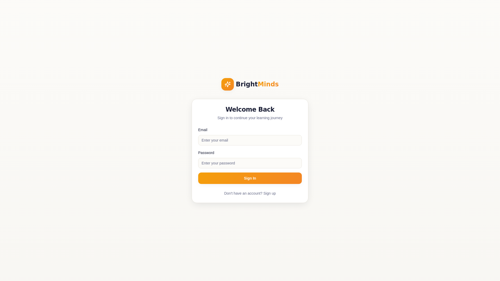

# BrightMinds Tutoring Platform

A peer-to-peer tutoring marketplace connecting students with qualified tutors through intelligent matching.

**Live Site:** [https://brightminds.lovable.app](https://brightminds.lovable.app)


---

## About

I built BrightMinds to solve a problem I saw firsthand: students struggling to find the right tutor, and tutors struggling to find students who match their teaching style. The platform uses a matching algorithm that considers learning styles, goals, and personalities to create better tutor-student pairings.

---

## Features

### For Students

Students can browse tutors, get matched based on their learning preferences, book sessions, and communicate directly with their tutors.


**Key capabilities:**
- Browse and search tutors by subject, rate, and experience
- AI-powered matching based on learning style and goals
- Session booking with real-time availability
- Direct messaging with tutors
- Review system to help other students

### For Tutors

Tutors have full control over their profiles, availability, and pricing. The platform handles payments automatically through Stripe Connect.


**Key capabilities:**
- Profile management with subjects, rates, and bio
- Flexible scheduling and availability settings
- Stripe integration for direct payments
- Student management and session history
- Performance leaderboard for visibility

### Authentication

Secure login and registration for both students and tutors.



---

## Tech Stack

| Category | Technology |
|----------|------------|
| Frontend | React 18, TypeScript, Vite |
| Styling | Tailwind CSS, shadcn/ui |
| Backend | Supabase (PostgreSQL, Auth, Edge Functions) |
| Payments | Stripe Connect |
| AI | Google Gemini |
| State | TanStack Query |
| Routing | React Router v6 |

---

## Getting Started

### Prerequisites
- Node.js 18+
- npm or bun

### Installation

```bash
git clone https://github.com/yourusername/brightminds.git
cd brightminds
npm install
npm run dev
```

### Environment Variables

Create a `.env` file:

```env
VITE_SUPABASE_URL=your_supabase_url
VITE_SUPABASE_PUBLISHABLE_KEY=your_supabase_anon_key
```

---

## Project Structure

```
src/
├── components/     # UI components
│   └── ui/         # Base components (shadcn/ui)
├── pages/          # Route pages
├── hooks/          # Custom hooks
├── integrations/   # Third-party integrations
└── lib/            # Utilities

supabase/
├── functions/      # Edge functions
└── migrations/     # Database migrations
```

---

## Payment Flow

1. Student books a session with a tutor
2. Payment processed via Stripe Checkout
3. Platform takes an 8% service fee
4. Tutor receives 92% directly to their connected Stripe account

---

## Security

- Row Level Security on all database tables
- Authentication via Supabase Auth
- PCI-compliant payment handling through Stripe Connect
- JWT verification on protected routes

---

## Responsive Design

The platform works across all devices:
- Desktop (1920px+)
- Laptop (1024px - 1919px)
- Tablet (768px - 1023px)
- Mobile (320px - 767px)

---

## Contributing

Pull requests are welcome. For major changes, please open an issue first to discuss what you'd like to change.

---

## License

MIT

---

## Contact

Questions or feedback? Reach out through the contact form on the platform.
